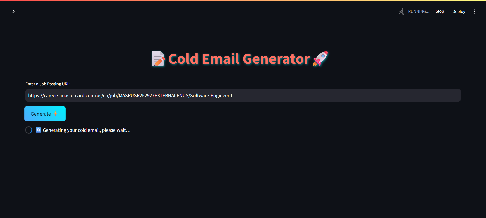
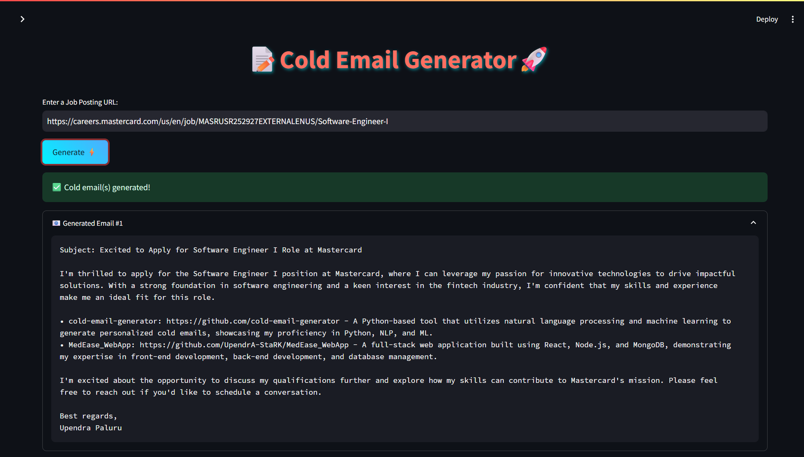
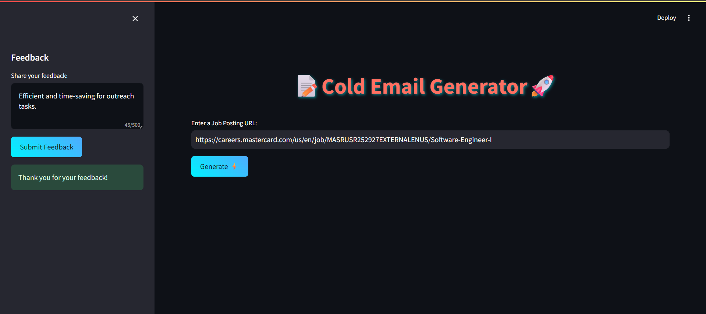

# 🚀 AI-Powered Cold Email Generator

An intelligent and fully customizable cold email generator built using **LLaMA 3.1**, **LangChain**, and **Streamlit**. Designed for job seekers, marketers, and outreach professionals who want to send highly personalized and recruiter-ready cold emails — fast.


---

## ✨ Features

- 🔍 **Job Role Understanding** – Extracts role, required skills, and summary from job listings or manual input.
- 📌 **Portfolio Matching** – Uses **ChromaDB** to match your resume or project CSV with job requirements.
- 💌 **Cold Email Generation** – Context-aware emails tailored using **Groq’s LLaMA 3.1** via **LangChain**.
- 💬 **Feedback Module** – Integrated **SQLite** database to collect feedback and continuously improve email quality.
- 🌐 **Streamlit UI** – Clean, responsive, and interactive frontend with copy/share functionality.

---


## Project Preview




---

## 📦 Tech Stack

| Layer         | Tech Used                              |
|---------------|-----------------------------------------|
| 💻 Frontend   | Streamlit                               |
| 🧠 AI Model   | LLaMA 3.1 (via Groq API + LangChain)    |
| 🧠 Matching   | ChromaDB (local vector DB)              |
| 📁 Backend    | Python, LangChain                       |
| 🗄️ Storage    | SQLite (Feedback DB), Pandas (CSV Input)|
| 🔐 Secrets    | dotenv (.env for API keys)              |

---

## 🛠️ Setup Instructions

1. To get started we first need to get an API_KEY from here: https://console.groq.com/keys. Inside `app/.env` update the value of `GROQ_API_KEY` with the API_KEY you created. 


2. To get started, first install the dependencies using:
    ```commandline
     pip install -r requirements.txt
    ```
   
3. Run the streamlit app:
   ```commandline
   streamlit run app/main.py
   ```
